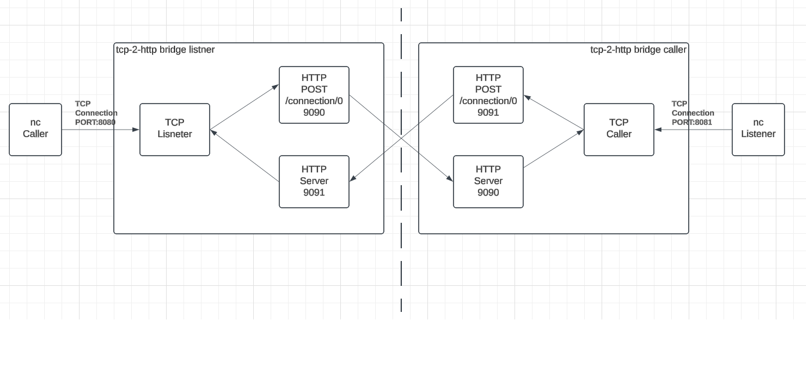

# A bridge from TCP to HTTP

## Build

```bash
go build -o tcp-bridge main.go
```

## Run

Let's suppose that we have the following use case



A panel wants to connect to a switcher. The connection is over TCP and is initiated by the panel.

Listener is running on the switcher.

Caller is the panel.

Start a Listener bridge on the panel side.

```bash
./tcp-bridge --tcpp=8080 --httppout=9090 --httppin=9091 --mode=listener
```

Start a Caller bridge on the switcher side.

```bash
./tcp-bridge --tcpp=8081 --httppout=9091 --httppin=9090 --mode=caller
```

When the Panel initiates a connection, it will open it with the listener bridge.

On the first message sent, from the panel to the switcher, the listener bridge will send a POST to the caller bridge HTTP server.

The caller bridge will initiate a connection with the switcher and send the message.

Beyond that point, bidirectional traffic should flow from,

Switcher to Panel
Panel to Switcher.
